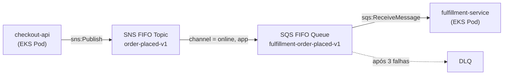

Quando um serviço publica um evento, outros serviços frequentemente precisam reagir a ele — de forma independente, assíncrona, e sem que o publicador saiba quem está ouvindo. [SNS](https://aws.amazon.com/sns/) + [SQS](https://aws.amazon.com/sqs/) é o padrão AWS de fanout para isso. As variantes [FIFO](https://docs.aws.amazon.com/AWSSimpleQueueService/latest/SQSDeveloperGuide/sqs-fifo-queues.html) são a escolha certa quando você precisa de processamento ordenado e exactly-once.

Este post mostra como provisionar uma infraestrutura de fanout FIFO SNS/SQS no EKS usando Terraform, com políticas de filtro de assinatura e permissões IAM configuradas via EKS Pod Identity.

## Arquitetura



`checkout-api` publica eventos `order-placed`. `fulfillment-service` os consome — mas apenas para pedidos feitos pelos canais online ou app. A política de filtro é o que torna isso extensível: um futuro `store-service` poderia assinar o mesmo tópico com `channel = in-store`, recebendo apenas os seus eventos relevantes sem nenhuma mudança no publicador ou no consumidor existente.

## Premissas

Este post assume um ambiente onde:

- Os serviços rodam como pods no **EKS**, com service accounts do Kubernetes já criados para cada workload (`checkout-api` e `fulfillment-service`).
- O **EKS Pod Identity** está configurado, vinculando cada service account ao seu próprio IAM role (`aws_iam_role.checkout_api` e `aws_iam_role.fulfillment_service`).
- Existe uma forma estabelecida de **aplicar e gerenciar o estado do Terraform** com permissões IAM suficientes para criar e gerenciar tópicos SNS, filas SQS, e IAM roles e policies.

## SNS FIFO Topic

```hcl
resource "aws_sns_topic" "order_placed" {
  name                        = "${var.env}-order-placed-v1.fifo"
  fifo_topic                  = true
  content_based_deduplication = true
}
```

O sufixo `.fifo` é exigido pela AWS — a validação de nome rejeitará o recurso sem ele.

`content_based_deduplication = true` faz com que o SNS gere o ID de deduplicação a partir do corpo da mensagem, dispensando os publicadores de fornecer um `MessageDeduplicationId` explicitamente. Isso significa que duas mensagens com corpos idênticos publicadas dentro da janela de deduplicação de 5 minutos são silenciosamente deduplicadas e apenas uma é entregue.

Os publicadores devem incluir um `MessageGroupId` em cada chamada `sns:Publish` — isso é obrigatório em todos os tópicos FIFO e não é opcional. O group ID determina o escopo de ordenação: mensagens com o mesmo group ID são entregues na ordem em que foram publicadas, e uma mensagem bloqueada em um grupo não afeta a entrega em outros grupos.

## SQS FIFO Queue e DLQ

```hcl
resource "aws_sqs_queue" "fulfillment_order_placed_dlq" {
  name                      = "${var.env}-fulfillment-order-placed-v1-dlq.fifo"
  fifo_queue                = true
  message_retention_seconds = 1209600
}

resource "aws_sqs_queue" "fulfillment_order_placed" {
  name                       = "${var.env}-fulfillment-order-placed-v1.fifo"
  fifo_queue                 = true
  visibility_timeout_seconds = 60
  redrive_policy = jsonencode({
    deadLetterTargetArn = aws_sqs_queue.fulfillment_order_placed_dlq.arn
    maxReceiveCount     = 3
  })
}
```

Nenhuma das filas define `content_based_deduplication`. O SNS encaminha o ID de deduplicação que ele gerou para a fila SQS, de modo que a fila deduplica usando o ID fornecido pelo SNS sem precisar do seu próprio hashing baseado em conteúdo.

`visibility_timeout_seconds` se aplica ao lote inteiro a partir do momento em que `ReceiveMessage` retorna. O valor correto depende de como seu consumidor processa as mensagens:

- **Processamento serial do lote**: use `NumberOfMessagesReceived × MaximumExpectedProcessingTime`. Se você recebe 10 mensagens e cada uma pode levar até 5 segundos, o timeout deve cobrir todos os 50 segundos.
- **Processamento paralelo do lote**: use `MaximumExpectedProcessingTime`, pois todas as mensagens do lote são processadas concorrentemente.

Se o processamento demorar mais que o timeout, o SQS reenvia as mensagens, consumindo as tentativas de retry e arriscando processamento duplicado.

`maxReceiveCount = 3` é uma escolha deliberada em uma fila FIFO, não apenas um orçamento de tentativas. Filas FIFO garantem entrega ordenada dentro de um message group: se a primeira mensagem de um grupo falha e fica na fila, nenhuma mensagem subsequente desse grupo é entregue até que ela seja processada ou enviada para a dead-letter. Muitas tentativas em uma mensagem problemática significam que todo o message group fica bloqueado. Três tentativas cobrem falhas transientes sem criar bloqueios longos.

`message_retention_seconds = 1209600` define a DLQ com o período de retenção máximo de 14 dias. Como a AWS não cobra pelo armazenamento do SQS, não há motivo de custo para definir um valor menor na DLQ — a janela maior dá mais tempo para investigar e reprocessar mensagens com falha antes que sejam perdidas.

## Queue Policy

O SNS precisa de permissão para escrever na fila SQS. O ponto-chave é a condição `aws:SourceArn`:

```hcl
data "aws_iam_policy_document" "fulfillment_sqs_receive_from_sns" {
  statement {
    effect    = "Allow"
    actions   = ["sqs:SendMessage"]
    resources = [aws_sqs_queue.fulfillment_order_placed.arn]
    principals {
      type        = "Service"
      identifiers = ["sns.amazonaws.com"]
    }
    condition {
      test     = "ArnEquals"
      variable = "aws:SourceArn"
      values   = [aws_sns_topic.order_placed.arn]
    }
  }
}

resource "aws_sqs_queue_policy" "fulfillment_order_placed" {
  queue_url = aws_sqs_queue.fulfillment_order_placed.id
  policy    = data.aws_iam_policy_document.fulfillment_sqs_receive_from_sns.json
}
```

Sem a condição `aws:SourceArn`, qualquer tópico SNS na sua conta AWS poderia escrever nessa fila. Sempre restrinja ao ARN do tópico específico.

## Assinatura com Filter Policy

```hcl
resource "aws_sns_topic_subscription" "fulfillment_order_placed" {
  topic_arn           = aws_sns_topic.order_placed.arn
  protocol            = "sqs"
  endpoint            = aws_sqs_queue.fulfillment_order_placed.arn
  filter_policy_scope = "MessageAttributes"
  filter_policy = jsonencode({
    channel = ["online", "app"]
  })
}
```

Mensagens que não correspondem ao filtro são descartadas no nível do SNS e nunca chegam à fila SQS. O publicador define o atributo `channel` ao chamar `sns:Publish`.


## IAM: Publicador e Consumidor

**Publicador (`checkout-api`) — `sns:Publish` no tópico:**

```hcl
data "aws_iam_policy_document" "checkout_api_sns_publish" {
  statement {
    sid       = "PublishOrderPlaced"
    effect    = "Allow"
    actions   = ["sns:Publish"]
    resources = [aws_sns_topic.order_placed.arn]
  }
}

resource "aws_iam_role_policy" "checkout_api_sns_publish" {
  name   = "${var.env}-checkout-api-sns-publish-order-placed-v1"
  role   = aws_iam_role.checkout_api.id
  policy = data.aws_iam_policy_document.checkout_api_sns_publish.json
}
```

**Consumidor (`fulfillment-service`) — ações de recebimento SQS na fila:**

```hcl
data "aws_iam_policy_document" "fulfillment_sqs_consume" {
  statement {
    sid    = "ConsumeOrderPlaced"
    effect = "Allow"
    actions = [
      "sqs:ReceiveMessage",
      "sqs:DeleteMessage",
      "sqs:ChangeMessageVisibility",
      "sqs:GetQueueAttributes",
      "sqs:GetQueueUrl",
    ]
    resources = [aws_sqs_queue.fulfillment_order_placed.arn]
  }
}

resource "aws_iam_role_policy" "fulfillment_sqs_consume" {
  name   = "${var.env}-fulfillment-sqs-consume-order-placed-v1"
  role   = aws_iam_role.fulfillment_service.id
  policy = data.aws_iam_policy_document.fulfillment_sqs_consume.json
}
```

Cada role é vinculado ao seu Kubernetes service account via `aws_eks_pod_identity_association`, restringindo as permissões AWS ao workload do pod específico.

## Conclusão

O padrão completo apresentado neste post fornece processamento de eventos ordenado e exactly-once com desacoplamento limpo entre serviços.

A filter policy permite que os consumidores roteiem apenas as mensagens relevantes sem que o publicador precise se preocupar com quem está ouvindo.
