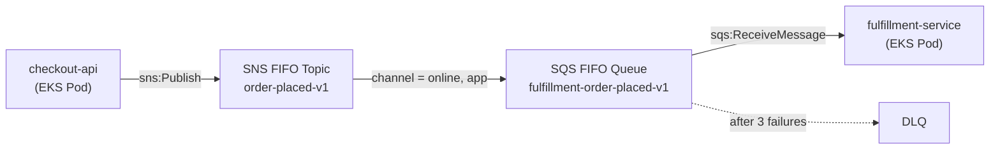

When a service publishes an event, other services often need to react to it — independently, asynchronously, and without the publisher knowing who's listening. [SNS](https://aws.amazon.com/sns/) + [SQS](https://aws.amazon.com/sqs/) is the AWS standard fanout pattern for this. The [FIFO](https://docs.aws.amazon.com/AWSSimpleQueueService/latest/SQSDeveloperGuide/sqs-fifo-queues.html) variants are the right choice when you need ordered, exactly-once delivery.

This post walks through provisioning a FIFO SNS/SQS fanout infrastructure on EKS using Terraform, with subscription filter policies and IAM permissions wired via EKS Pod Identity.

## Architecture



`checkout-api` publishes `order-placed` events. `fulfillment-service` consumes them — but only for orders placed through online or app channels. The filter policy is what makes this extensible: a future `store-service` could subscribe to the same topic with `channel = in-store`, receiving only its relevant events with no changes to the publisher or the existing consumer.

## Assumptions

This post assumes an environment where:

- Services run as pods on **EKS**, with Kubernetes service accounts already created for each workload (`checkout-api` and `fulfillment-service`).
- **EKS Pod Identity** is configured, binding each service account to its own IAM role (`aws_iam_role.checkout_api` and `aws_iam_role.fulfillment_service`).
- There is an established way to **apply and manage Terraform state** with sufficient IAM permissions to create and manage SNS topics, SQS queues, and IAM roles and policies.

## SNS FIFO Topic

```hcl
resource "aws_sns_topic" "order_placed" {
  name                        = "${var.env}-order-placed-v1.fifo"
  fifo_topic                  = true
  content_based_deduplication = true
}
```

The `.fifo` suffix is required by AWS — naming validation will reject the resource without it.

`content_based_deduplication = true` means SNS generates the deduplication ID from the message body, so publishers don't need to supply a `MessageDeduplicationId` explicitly. This means that two messages with identical bodies published within the 5-minute deduplication window are silently deduplicated and only one is delivered.

## SQS FIFO Queue and DLQ

```hcl
resource "aws_sqs_queue" "fulfillment_order_placed_dlq" {
  name                      = "${var.env}-fulfillment-order-placed-v1-dlq.fifo"
  fifo_queue                = true
  message_retention_seconds = 1209600
}

resource "aws_sqs_queue" "fulfillment_order_placed" {
  name                       = "${var.env}-fulfillment-order-placed-v1.fifo"
  fifo_queue                 = true
  visibility_timeout_seconds = 60
  redrive_policy = jsonencode({
    deadLetterTargetArn = aws_sqs_queue.fulfillment_order_placed_dlq.arn
    maxReceiveCount     = 3
  })
}
```

`visibility_timeout_seconds` should be set to at least 6× your consumer's average processing time. Once a message is received, SQS hides it from other consumers for this duration. If processing takes longer than the timeout, SQS redelivers the message — burning a retry count and risking duplicate processing.

`maxReceiveCount = 3` is a deliberate choice in a FIFO queue, not just a retry budget. FIFO queues guarantee ordered delivery within a message group: if the first message in a group fails and stays in the queue, no subsequent message in that group is delivered until it's processed or dead-lettered. Too many retries on a poison message means the entire message group is blocked. Three retries cover transient failures without creating long blockages.

`message_retention_seconds = 1209600` — 14 days is the maximum SQS retention period, and since AWS does not charge for SQS storage, there's no cost reason to set it lower. The longer window gives you more time to investigate and replay failed messages before they're gone.

## Queue Policy

SNS needs permission to write to the SQS queue. The key is the `aws:SourceArn` condition:

```hcl
data "aws_iam_policy_document" "fulfillment_sqs_receive_from_sns" {
  statement {
    effect    = "Allow"
    actions   = ["sqs:SendMessage"]
    resources = [aws_sqs_queue.fulfillment_order_placed.arn]
    principals {
      type        = "Service"
      identifiers = ["sns.amazonaws.com"]
    }
    condition {
      test     = "ArnEquals"
      variable = "aws:SourceArn"
      values   = [aws_sns_topic.order_placed.arn]
    }
  }
}

resource "aws_sqs_queue_policy" "fulfillment_order_placed" {
  queue_url = aws_sqs_queue.fulfillment_order_placed.id
  policy    = data.aws_iam_policy_document.fulfillment_sqs_receive_from_sns.json
}
```

Without the `aws:SourceArn` condition, any SNS topic in your AWS account could write to this queue. Always scope it to the specific topic ARN.

## Subscription with Filter Policy

```hcl
resource "aws_sns_topic_subscription" "fulfillment_order_placed" {
  topic_arn           = aws_sns_topic.order_placed.arn
  protocol            = "sqs"
  endpoint            = aws_sqs_queue.fulfillment_order_placed.arn
  filter_policy_scope = "MessageAttributes"
  filter_policy = jsonencode({
    channel = ["online", "app"]
  })
}
```

Messages that don't match the filter are discarded at the SNS level and never reach the SQS queue. The publisher sets the `channel` attribute when calling `sns:Publish`.


## IAM: Publisher and Consumer

**Publisher (`checkout-api`) — `sns:Publish` on the topic:**

```hcl
data "aws_iam_policy_document" "checkout_api_sns_publish" {
  statement {
    sid       = "PublishOrderPlaced"
    effect    = "Allow"
    actions   = ["sns:Publish"]
    resources = [aws_sns_topic.order_placed.arn]
  }
}

resource "aws_iam_role_policy" "checkout_api_sns_publish" {
  name   = "${var.env}-checkout-api-sns-publish-order-placed-v1"
  role   = aws_iam_role.checkout_api.id
  policy = data.aws_iam_policy_document.checkout_api_sns_publish.json
}
```

**Consumer (`fulfillment-service`) — SQS receive actions on the queue:**

```hcl
data "aws_iam_policy_document" "fulfillment_sqs_consume" {
  statement {
    sid    = "ConsumeOrderPlaced"
    effect = "Allow"
    actions = [
      "sqs:ReceiveMessage",
      "sqs:DeleteMessage",
      "sqs:ChangeMessageVisibility",
      "sqs:GetQueueAttributes",
      "sqs:GetQueueUrl",
    ]
    resources = [aws_sqs_queue.fulfillment_order_placed.arn]
  }
}

resource "aws_iam_role_policy" "fulfillment_sqs_consume" {
  name   = "${var.env}-fulfillment-sqs-consume-order-placed-v1"
  role   = aws_iam_role.fulfillment_service.id
  policy = data.aws_iam_policy_document.fulfillment_sqs_consume.json
}
```

Each role is bound to its Kubernetes service account via `aws_eks_pod_identity_association`, scoping the AWS permissions to the specific pod workload.

## Wrapping Up

The full pattern presented in this post gives you ordered, exactly-once event delivery with clean decoupling between services.

The filter policy enables consumers to route only relevant messages without the publisher having to care about who's listening.
